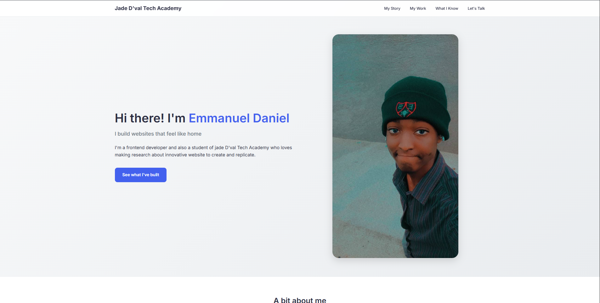

# Emmanuel Daniel - Portfolio

## About Me
My name is Emmanuel Daniel, a frontend developer of Jade D'val Tech academy who loves to learn new things about Technology everyday. I believe technology should bring people together and make life a little better.

## This Project
This is my personal portfolio website where I share my work and what I'm passionate about. It's built to be clean, easy to use, .

## What I Used
- HTML that makes sense
- CSS that works everywhere
- Google Fonts for nice reading
- Careful thinking about how it works on phones and computers

## How I Built It
I started by thinking about how people would use this on their phones, then made it work great on bigger screens too. I focused on:
- Making it easy to read and navigate
- Keeping the code clean and organized
- Making sure everyone can use it, no matter how they browse the web
- Using CSS tricks instead of JavaScript to keep things simple

## See It Live
Check out the live site: [http://127.0.0.1:5500/index.html]

## A Peek at the Site
 Laptop view
